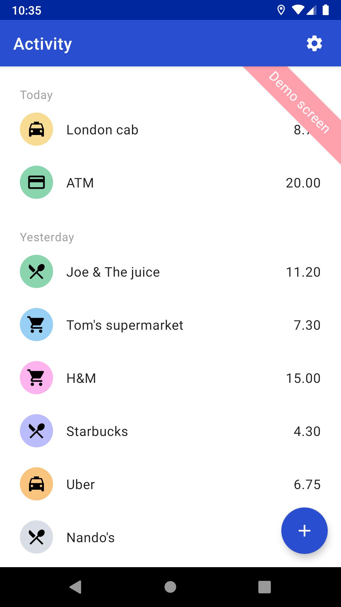
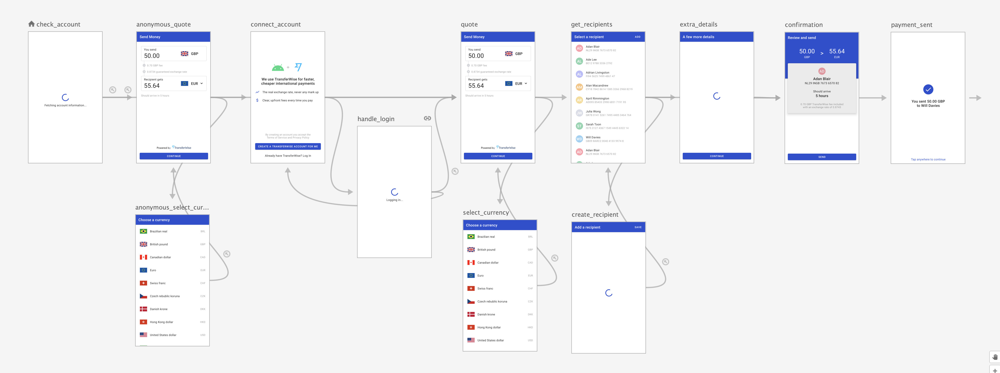

# Bank Integrations Reference Implementation (Android)
The reference implementation for designing the international payments experience with the TransferWise API.

This implementation is based on the following documents:

- [Bank Integrations Design Guide](https://www.notion.so/Bank-Integrations-Design-Guide-8c375c5c5f1e4c64953b4b601ff6abc6)
- [TransferWise for Banks API](https://transferwise.github.io/api-docs-banks/#transferwise-for-banks-api)

Have a look at [Bank Integrations Reference Implementation (Backend)](https://github.com/transferwise/t4b-backend) for a reference backend implementation.

# Overview
The reference application consists of three main modules:

- `app module`: simulates a demo banking application and doesn't contain any TransferWise reference code
- `transferwise module`: implementation of all code and screens to integrate the [TransferWise for Banks API](https://transferwise.github.io/api-docs-banks/#transferwise-for-banks-api)
- `dynamicform module`: reusable library that renders dynamic forms returned by the [TransferWise for Banks API](https://transferwise.github.io/api-docs-banks/#transferwise-for-banks-api)

## App module
> This module doesn't contain any TransferWise reference code and shouldn't be reused.

A very basic module that simulates a bank application and integrates the TransferWise component.

&emsp;

### Learn more
:point_right: [Learn more about the App module](https://github.com/transferwise/banksDemo-Android/tree/master/app/README.md).

## TransferWise module
> This module can be copied to bootstrap your integration of the [TransferWise for Banks API](https://transferwise.github.io/api-docs-banks/#transferwise-for-banks-api). Note that only the full flow can easily be reused, not the different steps independently.

This module represents the reference implementation of the [TransferWise for Banks API](https://transferwise.github.io/api-docs-banks/#transferwise-for-banks-api) and contains all screens to handle an international payment flow.



### Learn more
:point_right: [Learn more about the TransferWise module](https://github.com/transferwise/banksDemo-Android/blob/master/transferwise/README.md) and its architectural choices.

## Dynamic forms module
> This module can reused to render dynamic forms returned by the [TransferWise for Banks API](https://transferwise.github.io/api-docs-banks/#transferwise-for-banks-api). While it is fully tested and has a simple, generic API, its interface needs more polish to distribute it as a Maven artifact (e.g. thread safety, review contracts,...).

Some endpoints in the TransferWise API return a dynamic UI that needs to be rendered to the user.

These endpoints are:

- [Recipient account requirements](https://transferwise.github.io/api-docs-banks/#recipient-accounts-requirements), used to get the necessary fields to create a new recipient.
- [Transfer requirements](https://transferwise.github.io/api-docs-banks/#transfers-requirements), needed to get the necessary fields to complete a transfer.  

Rendering such a dynamic UI is quite challenging and therefore, the reference implementation contains a separate module `dynamicforms` that handles all that complexity for you.

### Learn more
:point_right: [Learn more about the Dynamic forms module](https://github.com/transferwise/banksDemo-Android/blob/master/dynamicform/README.md) and how to integrate it.

# Development setup
The banks reference requires Android Studio version 3.6 or higher. The latest version can be downloaded from [here](https://developer.android.com/studio).

This project uses the Gradle build system:

- To build this project, use `./gradlew assembleDebug`
- To run all unit tests, use `./gradlew testDebugUnitTest`

For more resources on learning Android development, visit the [Developer Guides](https://developer.android.com/guide/) at [developer.android.com](https://developer.android.com/).

## Getting started
The banking reference implementation can be tested both offline and online.

### Offline
Checkout the source code and install the application on an Android device. Make sure to check the "Enable offline demo mode" toggle and you can go through most of the flow without needing to set up an instance of the reference backend.

Limitations:

- All requests will be simulated to be successful, so you won't see any backend failures
- The simulated customer already has a TransferWise account connected, so the anonymous quote (step 2) and sign up flow (steps 3) are skipped
- All server responses are static (e.g. entering a different quote amount won't change the receiving amount)  

### Online
Checkout the source code and provide your own instance of `BackendConfiguration` with a:

 - `url` -> where the [Bank Integrations Reference Implementation (Backend)](https://github.com/transferwise/t4b-backend) is running
 - `loginUrl` -> pointing to the production or sandbox TransferWise authorization endpoint
 - `loginClientId` -> unique Id identifying your product (contact TransferWise to acquire an Id)

 Then provide this configuration as a parameter to the `InternationalTransferActivity`, install the application and run it with the "Enable offline demo mode" toggle unchecked.

## Code style
This project uses [ktlint](https://github.com/pinterest/ktlint), provided via the [spotless gradle plugin](https://github.com/diffplug/spotless).

Please run `./gradlew spotlessApply` before merging pull requests to format all code and apply the appropriate copyright headers.

# License
```
Copyright 2019 TransferWise Ltd.

Licensed under the Apache License, Version 2.0 (the "License");
you may not use this file except in compliance with the License.
You may obtain a copy of the License at

     http://www.apache.org/licenses/LICENSE-2.0

Unless required by applicable law or agreed to in writing, software
distributed under the License is distributed on an "AS IS" BASIS,
WITHOUT WARRANTIES OR CONDITIONS OF ANY KIND, either express or implied.
See the License for the specific language governing permissions and
limitations under the License.
```
